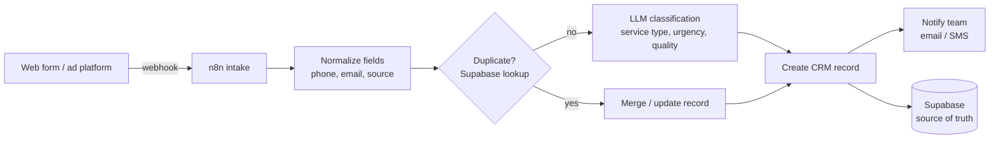

# Luis Padilla — AI Operations & Automation

I build production automation and AI systems that U.S. small businesses run themselves: self-hosted n8n, Claude API integrations, lead-capture pipelines, RAG chatbots, and CRM automations — documented well enough that non-technical teams operate them without me.

📍 Mazatlán, MX · U.S. business hours · 🇪🇸 native / 🇬🇧 C1
📫 luispadilla2702@gmail.com · [LinkedIn](https://www.linkedin.com/in/luis-padilla-12389020b)

---

## Live work you can poke at

| Project | What it is | Stack |
|---|---|---|
| [ollin.agency](https://ollin.agency/) | Agency site with a **RAG chatbot** — ask it anything about the business and it answers from site content embedded in a vector store | Next.js · Supabase (pgvector) · Claude API |
| [zerosporerestoration.com](https://www.zerosporerestoration.com/) | Mold remediation company site, SEO-first build | Next.js |
| [quickfixhandyman.construction](https://quickfixhandyman.construction/) | Handyman services site, SEO-first build | Next.js |

Together these generate **4–5 inbound leads/month organically at $0 ad spend** — design, build, content, and launch handled end-to-end, with supporting video/image assets produced with AI tooling (Google Veo, Nano Banana Pro).

---

## Reference architecture: automated lead capture

The pattern I deploy for service businesses to replace manual lead handling. Built on n8n (self-hosted) + Supabase + LLM classification.

Design decisions that make it production-grade rather than a demo:

- **Idempotency & dedup before anything else** — the same lead arriving twice (retries, double-submits, multi-channel) never becomes two CRM records or two notifications.
- **Structured LLM outputs** — classification returns validated JSON, not prose; a failed parse routes to a fallback, never a silent drop.
- **Error handling & retries with dead-lettering** — failed steps retry with backoff; unrecoverable payloads are stored and surfaced, not lost.
- **Human-readable handoff** — every workflow ships with a written SOP + video walkthrough so the business owns it.

**Infrastructure:** n8n self-hosted on a hardened Linux VPS — Docker Compose, Traefik with Let's Encrypt TLS, Postgres 16 backend, secured credential management.

## Currently

Embedded full-time as the dedicated AI & automation specialist for a U.S. small business (engagement under NDA): process auditing and documentation, workflow automation, CRM/API integrations, LLM-assisted intake, and automated reporting for ownership.

## Coming next

A public, end-to-end demo of the lead-capture pattern above for a fictional service company — live endpoint, exported workflows, and a video walkthrough.

---

## Stack

**Automation:** n8n (self-hosted) · Zapier · webhooks & REST APIs · Docker · Traefik/TLS
**AI:** Claude API · OpenRouter · prompt engineering & structured outputs · RAG (pgvector, embeddings/chunking) · agent configuration
**Data:** PostgreSQL / Supabase · Notion-as-CRM · GoHighLevel & Salesforce exposure
**Web:** Next.js · Node.js · JavaScript · Python (working proficiency)

## How I work

1. **Map before building.** I audit the real process with the people who live in it — automation aimed at a broken process just breaks faster.
2. **Prototype in days, then harden.** Working software earns trust; iteration makes it reliable.
3. **Document everything.** SOPs and video walkthroughs, so the system outlives my involvement.
4. **Honest about limits.** I'll tell you where AI creates leverage and where it creates noise.
